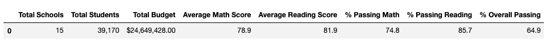
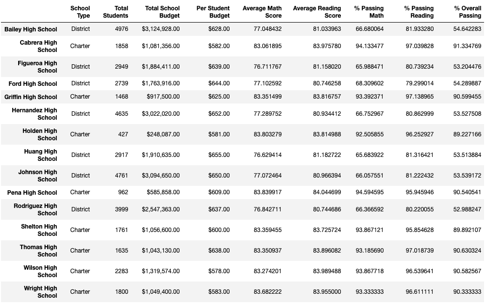
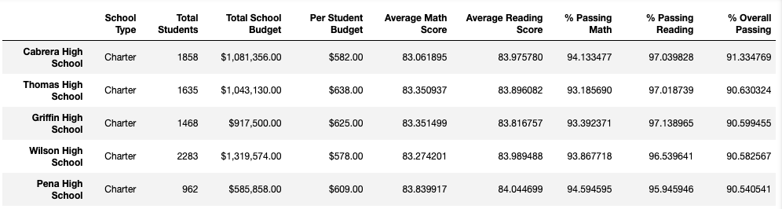
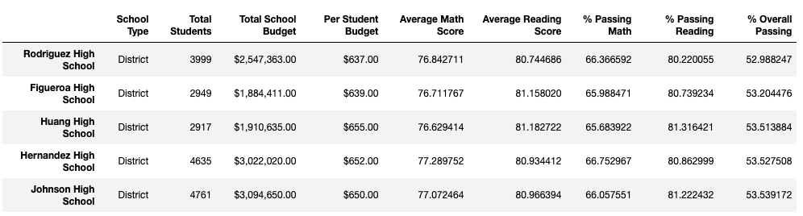
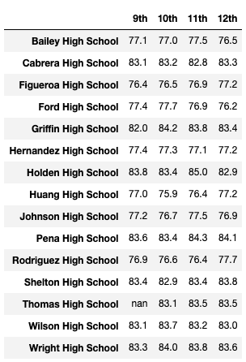
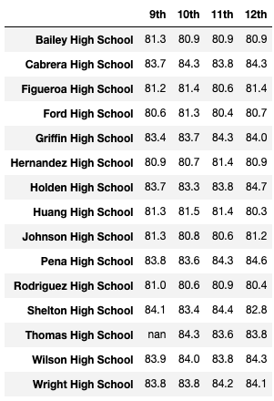
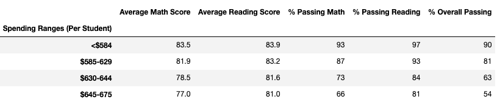
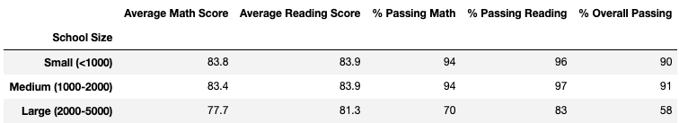
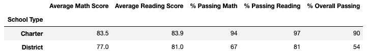

# School District Analysis

*Prepared for Maria - 2021 JAN 24*

## Overview of the School District Analysis

### Purpose

This report is an addendum to the orginal analysis of high school grades within the board. The main purpose of the orginal report was to determine budget and school priorities for the upcoming year, however academic dishonesty is suspected in the grade 9 level at Thomas High School, and therefore the data analysis needs to be updated in order to understand the extent of impact that the academic dishonesty from Thomas High School and ensure that they uphold state-testing standards. This updated analysis will be performed by replacing all grade 9 math and reading marks from Thomas High School with NaN, and they will therefore not be included in the data, allowing all other associated data with this student group to remain intact. The total number of marks with NaN was **461**. This analysis and the updated data findings to the school board, which will inlcude the following:

* District Summary
* School Summary
* Top 5 and botton 5 performing schools
* The average math score for each grade level from each school
* The average reading score for each grade level from each school
* The scores by school spending per student
* The scores by school size
* The scores by school type

### Resources

* Data sources: students_complete.csv, school_complete.csv
* Software: Python 3.8.5, jupyter notebook

## School District Analysis Results

### District Summary
As displayed in the district summary below, after removing the Thomas High School Grade 9 math and reading scores, the **Average Math Score** dropped by **0.1%**, the **% Passing Math** dropped by **0.2%**, the **% Passing Reading** dropped by **0.3%**, and the **% Overall Passing** dropped by **0.1%**. 

### School Summary

### Top 5 and bottom 5 performing schools

### The average math score for each grade level from each school

### The average reading score for each grade level from each school

### The scores by school spending per student

### The scores by school size

### The scores by school type

## Summary
Fortunately not of the above data analysis , and therefore the academic dishonesty from Thomas High School, although serious, did not impact the analysis.
